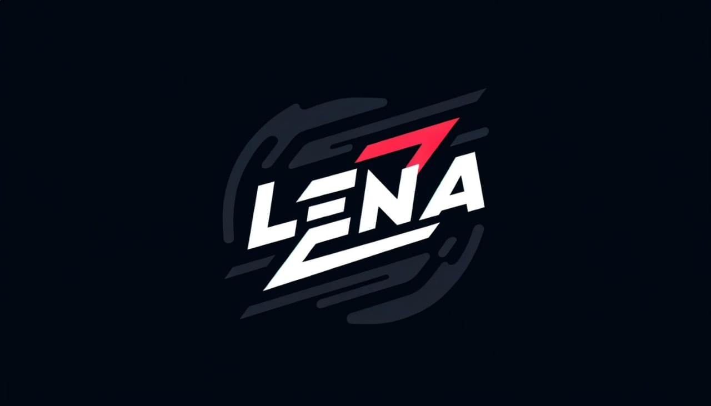

# Lena programming language



## Main information

* Interpreted/Compiled programming language

* Lightning Execution and Native Adaptability (LENA)

* Syntax = Python + Assembler + C/C++

* [Research link]("https://docs.google.com/document/d/18Vgb9FWkAmmvgFri58sekGLDtFrS8Uyf9xnZg77Jj1I/edit?usp=sharing")

## The language uses alternative methods for interpreting and executing code, which can affect performance and improve the quality of interpreted programming languages

## Areas of application

* Neural networks

* Education

* Computing and working with data

* Thread-oriented programming

## Hello World

```rust

/* Hello World example 1 */
cout << "Hello World!"

; Or

/* Hello World example 2 */
"Hello World!" >> cout

```

## Arrays

```rust

array = (5 times 2000)

; Or

array2 = {5, 5, 5, 5, 5} ; ... 2000 times

```
