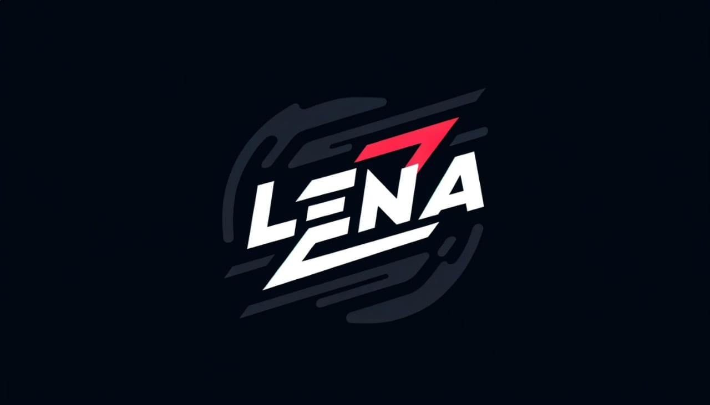

# Язык программирования Lena



## Основная информация

### Главное

* Компилируемый
* Исполняется на SHE (Программно-клонируемый гиперивизрный исполнитель)
* Синтакс получен из языков: Julia, Rust, языки ассемблера, С/С++
* Вдохновлён: Julia, Rust, Java

### Форматы файлов *.e.le.na*

* Формат исполняемых файлов байт-кода `.e`
* Формат файлов исходного кода: `.le`
* Формат расшифрованного байт-кода (не абстрактный) `.na`

## Объяснение работы языка Lena и исполнителя SHE

SHE - это комплекс программ для запуска приложения в изолированной от операционной системы среде.

Алгоритм работы языка Lena:

1. Открытие исполнямого файла *.exe* либо *.e* который компилируется в `lena`.

Пример компиляции файлов *.e* и *.exe*

```shell
lena app.le -o app.e --non-abstract
```

```shell
lena app.le -o app.exe --non-abstract
```

* *в UNIX подобных системах формат .exe указывать не надо*

2. *.exe* файл после запуска, загружает свой байт-код в оперативную память. Если файл в формате *.e*, то он запускается командой:

```shell
she app.e
```

3. Гипервизорный исполнитель способен создавать локальные, изолированные клоны для исполнения каждого приложения работающего в среде SHE. Это сделано потому что в отличии от типичных ВМ, SHE существует в виде **драйвера** или **модуля ядра ОС**. Другими словами, это изолированная "ОС" в основой системе.

4. Байт-код читается напрямую из ОЗУ, зачастую используя прямой доступ к физической памяти благодаря правам **драйвера** или **модуля ядра ОС**.

5. Клон SHE удаляет себя из памяти и освобождает ресурсы компьютера после завершения работы программы.

6. Программа закрывается для пользователя.

## Сферы применения

* Системное программирование

* Разработка игр

* Работа с данными и вычисления

## Привет мир

```rust
out("Привет мир!")
```

## Массивы и макросы

```rust

array = (5 times 2000)

; или

array2 = {5, 5, 5, 5, 5} ; ... 2000 раз
```
